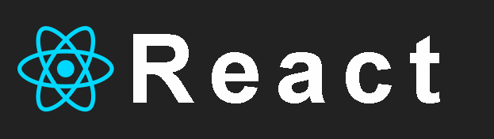
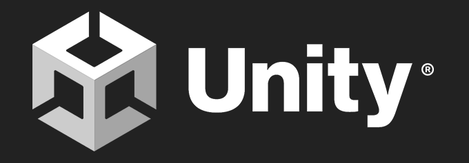

<h1 align="center"><b>Hi , I'm Liliana Solórzano Pérez </b></h1>

  

 

## <picture></picture> **About me**

 

-👋 Hi, I’m @LilianaSP a student of programming

-👀 I’m interested in full-stack developement, video-games development, 3D design, AI, and cybersecurity

-🌱 I’m currently learning software engineering

-💞️ I’m looking to collaborate on diverse innovative projects, focused on technological development combined with programming and design

-📫 How to reach via email: liliana.solorzano@hotmail.com or [Linkedin](linkedin.com/in/liliana-solórzano-pérez-8b1013205)

-I would love to be part of new projects, where -I am challenged to give the best of myself and my knowledge. I am a person who breaks with the stereotypes of engineering, where I combine my artistic and creative talents with programming, to carry out various projects in an innovative way.

  

  

## <b> Skills</b>
 

- **Languages**:
    
   

    

     
    
     
    
     
    
     
    

    
    
- **Front-End Development**:

   
   
   
   

 

- **Cloud Hosting**:

    
    
 

- **Softwares and Tools**:

    
    
    
    
     
    

 

- **Extras**:

    
       

 
